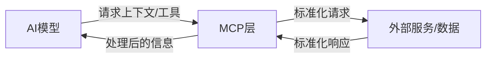
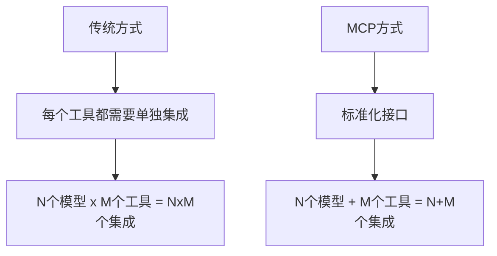

# MCP协议入门：打破AI与外部世界的隔离墙

## 引言：AI的"信息孤岛"困境

> "即使是最复杂的模型也受到与数据隔离的限制——被困在信息孤岛和传统系统之后。" —— Anthropic

大型语言模型（LLMs）如今在封闭环境中表现出色，但一旦需要获取超出其训练数据范围的信息时，就会遇到明显瓶颈。为了让AI代理真正发挥作用，它们必须能够在适当的时机访问正确的上下文——无论是文件、知识库还是工具，甚至能够基于这些上下文采取行动，如更新文档或发送电子邮件。

然而，历史上将AI模型连接到这些外部资源一直是一个混乱、临时性的过程。开发者不得不为每个数据源或API编写自定义代码或使用专门插件。这使得"组装式"集成变得脆弱且难以扩展。

为解决这一问题，Anthropic于2024年11月推出了Model Context Protocol (MCP)——一个旨在将AI助手与数据和工具世界连接起来的开放标准。虽然最初发布时反响平平，但到了2025年初，MCP迅速走红，甚至有望超越LangChain和CrewAI等工具，成为构建智能AI系统的关键技术。

本文将深入探讨MCP的核心概念、工作原理及其对AI生态系统的重要意义。

## MCP是什么？

Model Context Protocol（模型上下文协议）是一个开放标准，它定义了AI模型如何与外部数据源、工具和服务进行交互的统一方式。简单来说，MCP为AI模型提供了一个标准化的"接口"，使其能够：

1. **发现可用工具**：自动识别环境中可用的服务和功能
2. **检索信息**：从各种数据源获取上下文相关信息
3. **执行操作**：调用外部API或服务来完成任务

## MCP的核心组件

MCP架构主要包含三个关键组件：

### 1. MCP客户端

客户端是与AI模型直接交互的组件，负责：

- 接收模型的请求
- 将请求路由到适当的MCP服务器
- 将服务器响应返回给模型

常见的MCP客户端包括Claude桌面版、ChatWise、Cursor和Windsurf等AI应用。

### 2. MCP服务器

服务器是实际连接外部服务和数据源的组件，负责：

- 公开可用的工具和操作
- 执行模型请求的操作
- 返回结果给客户端

MCP服务器有两种主要模式：

- **Stdio模式**：主要用于本地服务，操作本地软件或文件
- **SSE模式**：主要用于远程服务，如访问在线API

### 3. MCP协议

连接客户端和服务器的标准通信协议，定义了：

- 工具描述格式
- 请求/响应结构
- 错误处理机制

## MCP为何现在受到关注？

MCP虽然在2024年11月就已推出，但直到2025年初才真正引起广泛关注，原因包括：

### 1. 解决集成难题

随着AI代理和自主工作流在2023-2024年成为热门话题，它们的阿喀琉斯之踵始终是与现实世界业务系统和数据的集成。MCP直接解决了这一关键痛点，定义了"如何连接现有数据源"的标准方式。

### 2. 社区与采用的增长

仅几个月内，MCP从概念发展为日益壮大的生态系统。早期采用者包括Block（Square）、Apollo、Zed、Replit等公司。到2025年2月，已有超过1000个社区构建的MCP服务器可用。

### 3. 事实标准的势头

与专有SDK或一次性框架不同，MCP是开放且与模型无关的，并得到了主要AI企业的支持。这意味着任何AI模型（Claude、GPT-4或开源LLM）都可以使用MCP，任何开发者或公司都可以创建MCP集成，无需许可。

## MCP如何工作：技术概述

从技术角度看，MCP的工作流程如下：

1. **发现阶段**：模型通过MCP客户端识别可用的MCP服务器及其功能
2. **请求阶段**：模型生成对特定工具/数据的请求，由客户端格式化并发送到相应服务器
3. **执行阶段**：服务器处理请求，与外部系统交互，并获取结果
4. **响应阶段**：结果返回给客户端，然后提供给模型

MCP的一个显著特点是**动态发现**——AI代理可以自动检测可用的MCP服务器及其功能，无需硬编码集成。

## MCP与传统工具集成的对比

在MCP出现之前，AI系统访问外部工具主要通过以下方式：

| **传统方式**               | **MCP方式**                |
| -------------------------- | -------------------------- |
| 为每个工具编写自定义连接器 | 使用统一标准接口           |
| 需要模型端和工具端同时修改 | 只需工具端适配MCP标准      |
| 双向集成复杂度（N×M问题）  | 单向集成复杂度（N+M问题）  |
| 工具变更需要重新集成       | 工具可自由升级而不影响模型 |
| 难以动态添加新功能         | 可即时发现新工具           |

## MCP不能解决的问题

尽管MCP极具前景，但它也有一些限制：

1. **不能替代模型能力**：MCP只提供获取信息和执行操作的途径，不能改善模型自身的推理、规划或判断能力
2. **不是编排引擎**：MCP不决定何时或为何使用工具，这仍需要模型或更高层的架构来决定
3. **不解决安全授权问题**：虽然MCP提供标准接口，但仍需负责任地管理对敏感数据的访问权限

## MCP在智能代理架构中的位置

MCP并非独立的代理大脑，而是智能代理架构中的集成层，它与LangChain、LangGraph或CrewAI等编排工具互为补充：

- **编排工具**决定代理什么时候、为什么使用工具
- **MCP**定义这些工具如何被调用以及信息如何交换

这种互补关系将N×M的集成复杂度问题简化为N+M问题，允许代理（客户端）和工具（服务器）之间实现通用兼容性。

## 结语：MCP的未来展望

MCP标志着AI工具生态从"封闭花园"走向"开放广场"的转变。正如HTTP协议统一了网页访问标准，MCP正在统一AI与工具的交互方式。

随着MCP不断成熟，我们可以期待：

- 更多预构建的MCP服务器，涵盖各种常见工具和数据源
- 更简化的部署和配置过程，降低使用门槛
- 更强大的安全和治理功能，使企业级应用更加安心
- 更丰富的生态系统，推动AI应用的创新和普及

在AI时代，熟练使用工具将成为核心竞争力，而了解MCP等底层原理将让你比他人更早一步掌握未来。

## 参考资料

- [Introducing the Model Context Protocol by Anthropic](https://www.anthropic.com/blog/introducing-model-context-protocol)
- [Model Context Protocol documentation](https://docs.anthropic.com/claude/docs/model-context-protocol)
- [MCP: Flash in the Pan or Future Standard? by LangChain](https://blog.langchain.dev/mcp-flash-or-future/)
- [Why MCP Won by swyx from Latent Space](https://www.latent.space/p/why-mcp-won)

---

顺便安利一下我们的产品——「Offer蛙」：AI 驱动的智能面试助手，帮你高效拿下心仪 Offer！官网：[www.mianshizhushou.com](https://www.mianshizhushou.com)
