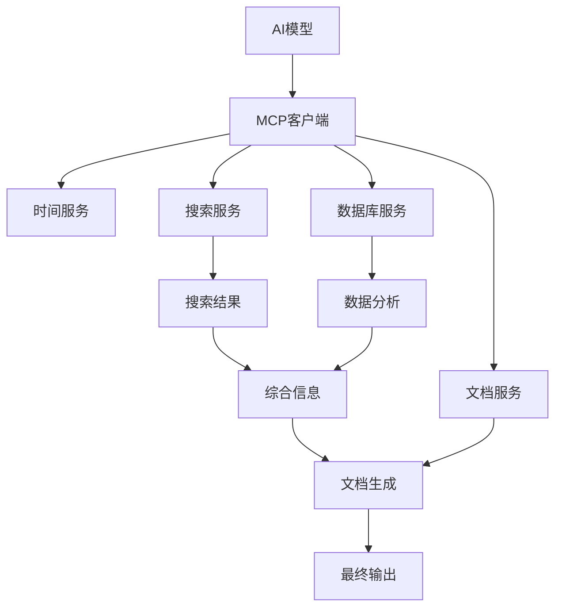
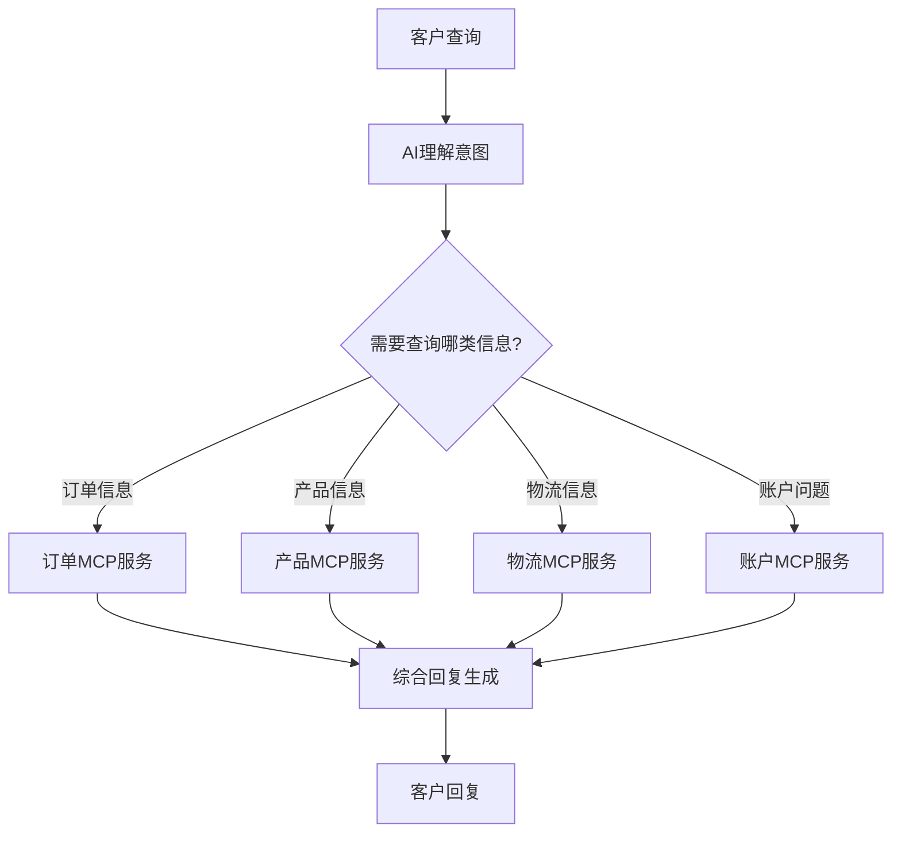

# MCP高级应用：多服务协同与企业级集成实践


## 引言：超越单一工具的智能协作

随着AI领域的迅速发展，单一功能的工具使用已不足以满足复杂业务场景的需求。在实际应用中，我们常常需要多个工具协同工作，形成一个完整的AI工作流程。例如，一个完整的商业分析流程可能需要结合时间服务、数据库查询、网络搜索、文档生成等多项功能。

Model Context Protocol (MCP)作为连接AI与外部世界的桥梁，其真正价值不仅在于简化单个工具的使用，更在于构建多服务协同的复杂工作流。然而，随着服务数量和复杂度的提升，我们需要更深入地理解MCP的高级应用技巧，才能充分发挥其潜力。

本文将深入探讨MCP在复杂场景中的应用方法，包括多服务协同、企业级集成、安全性管理、性能优化等高级主题，帮助开发者和企业用户构建更强大、更智能的AI应用系统。

## 多服务协同工作流的构建

### 设计多服务协同架构

在复杂场景下，单一MCP服务往往难以满足需求，此时需要设计多服务协同的工作流架构：



**实现多服务协同的关键策略**：

1. **服务分层**：将服务按功能类型和依赖关系分层，如基础服务层、数据处理层、输出层等
2. **信息传递**：确保上下文信息在不同服务间顺畅传递，避免信息丢失
3. **错误处理**：任一服务故障不应导致整个工作流崩溃，需妥善处理异常情况
4. **资源管理**：合理分配计算资源，避免某一服务占用过多资源而影响其他服务

### 案例：企业财报分析工作流

以下是一个综合性企业财报分析工作流，结合多个MCP服务协同工作：

1. **时间服务**：获取当前时间，确定分析的财季
2. **公司信息服务**：获取目标公司基本信息和股票代码
3. **财报检索服务**：从SEC或企业官网获取最新财报PDF
4. **PDF解析服务**：提取财报中的关键财务数据
5. **市场搜索服务**：获取相关行业动态和竞争对手信息
6. **数据分析服务**：进行财务比率计算和趋势分析
7. **报告生成服务**：将分析结果整合为结构化报告

**实现代码片段**：

```javascript
// 配置多服务MCP环境
const mcpConfig = {
  timeService: {
    command: 'uvx mcp-server-time --local-timezone Asia/Shanghai',
    priority: 'high',
  },
  companyInfoService: {
    command: 'npx -y company-info-mcp-server',
    env: { API_KEY: 'your_api_key' },
    priority: 'medium',
  },
  secFilingService: {
    command: 'npx -y sec-filing-mcp-server',
    env: { SEC_API_KEY: 'your_sec_api_key' },
    priority: 'medium',
  },
  // 更多服务配置...
}

// 服务优先级管理
function initializeServices(serviceConfigs) {
  // 按优先级顺序初始化服务
  const highPriorityServices = Object.entries(serviceConfigs).filter(
    ([_, config]) => config.priority === 'high'
  )

  const mediumPriorityServices = Object.entries(serviceConfigs).filter(
    ([_, config]) => config.priority === 'medium'
  )

  // 初始化高优先级服务
  for (const [name, config] of highPriorityServices) {
    initializeService(name, config)
  }

  // 初始化中优先级服务
  for (const [name, config] of mediumPriorityServices) {
    initializeService(name, config)
  }

  // 其他服务...
}
```

## 企业级MCP集成方案

企业环境下的MCP应用面临着更复杂的需求，包括安全合规、系统集成、用户管理等方面的考量。

### 企业安全与访问控制

企业级应用中，MCP服务的安全性至关重要，尤其是当这些服务需要访问敏感数据或核心系统时：

1. **身份验证**：为每个MCP服务实现强身份验证机制
2. **权限管理**：基于角色的访问控制（RBAC），限制不同用户对不同服务的访问权限
3. **审计日志**：记录所有MCP服务调用，便于安全审计和问题排查
4. **数据加密**：确保MCP服务之间的数据传输经过加密

**MCP服务权限控制示例**：

```python
class MCPAccessControl:
    def __init__(self, service_name):
        self.service_name = service_name
        self.permission_matrix = self._load_permission_matrix()

    def _load_permission_matrix(self):
        # 从配置文件或数据库加载权限矩阵
        return {
            "admin": ["all_services"],
            "analyst": ["time_service", "search_service", "data_analysis"],
            "viewer": ["time_service", "search_service"]
        }

    def check_permission(self, user_role, operation):
        if user_role == "admin" or "all_services" in self.permission_matrix.get(user_role, []):
            return True

        if self.service_name in self.permission_matrix.get(user_role, []):
            return True

        return False

    def log_access(self, user_id, operation, status):
        # 记录访问日志
        log_entry = {
            "timestamp": datetime.now().isoformat(),
            "user_id": user_id,
            "service": self.service_name,
            "operation": operation,
            "status": status
        }
        # 将日志写入安全审计系统
        SecurityAuditLogger.log(log_entry)
```

### 私有化部署与本地化适配

对于对数据隐私和安全有严格要求的企业，私有化部署MCP服务是必要的：

1. **内网部署**：在企业内网部署MCP服务，避免敏感数据外传
2. **容器化**：使用Docker、Kubernetes等技术containerize MCP服务，便于部署和管理
3. **服务编排**：实现服务间的自动发现和负载均衡
4. **资源隔离**：确保不同业务部门的MCP服务相互隔离，避免资源竞争

**Docker Compose配置示例**：

```yaml
version: '3'

services:
  mcp-gateway:
    image: mcp-gateway:latest
    ports:
      - '8000:8000'
    environment:
      - AUTH_SERVICE_URL=http://auth-service:8080
    networks:
      - mcp-network
    depends_on:
      - auth-service

  auth-service:
    image: mcp-auth-service:latest
    environment:
      - DB_HOST=auth-db
      - DB_USER=admin
      - DB_PASSWORD=secure_password
    networks:
      - mcp-network
    depends_on:
      - auth-db

  time-service:
    image: mcp-time-service:latest
    networks:
      - mcp-network

  search-service:
    image: mcp-search-service:latest
    environment:
      - SEARCH_API_KEY=${SEARCH_API_KEY}
    networks:
      - mcp-network

  # 更多MCP服务...

networks:
  mcp-network:
    driver: bridge
```

### 与现有企业系统集成

企业中已有大量系统和数据，MCP需要与这些系统无缝集成：

1. **ERP/CRM集成**：创建连接企业资源规划和客户关系管理系统的MCP服务
2. **数据仓库连接**：实现与企业数据仓库的安全连接，使AI可以查询历史数据
3. **文档管理系统**：连接企业文档管理系统，使AI能检索和生成内部文档
4. **工作流自动化**：将MCP服务集成到现有业务流程自动化系统中

**与SAP系统集成的MCP服务示例**：

```python
class SAPIntegrationMCPServer:
    def __init__(self, config):
        self.sap_connection = self._establish_sap_connection(config)
        self.tools = self._register_tools()

    def _establish_sap_connection(self, config):
        # 建立与SAP系统的安全连接
        from pyrfc import Connection

        return Connection(
            ashost=config['sap_host'],
            sysnr=config['sap_system_number'],
            client=config['sap_client'],
            user=config['sap_user'],
            passwd=config['sap_password']
        )

    def _register_tools(self):
        # 注册可用的SAP相关工具
        return {
            "query_sales_data": {
                "description": "Query sales data from SAP system",
                "parameters": {
                    "start_date": "Start date in YYYY-MM-DD format",
                    "end_date": "End date in YYYY-MM-DD format",
                    "product_category": "Optional product category filter"
                },
                "function": self.query_sales_data
            },
            "create_purchase_order": {
                "description": "Create a new purchase order in SAP",
                "parameters": {
                    "vendor_id": "SAP vendor ID",
                    "items": "List of items with quantity and material number",
                    "delivery_date": "Expected delivery date"
                },
                "function": self.create_purchase_order
            },
            # 更多SAP功能...
        }

    def query_sales_data(self, params):
        # 执行RFC调用查询销售数据
        try:
            result = self.sap_connection.call(
                'BAPI_SALESORDER_GETLIST',
                DATE_FROM=params['start_date'].replace('-', ''),
                DATE_TO=params['end_date'].replace('-', '')
            )

            # 处理和格式化结果
            return self._format_sales_data(result)

        except Exception as e:
            return {"error": str(e)}

    # 更多SAP交互方法...
```

## 优化MCP服务性能与可靠性

随着MCP在企业中的广泛应用，性能和可靠性成为关键考量因素：

### 服务性能优化

1. **缓存机制**：为频繁请求的数据实现智能缓存
2. **异步处理**：将耗时操作设计为异步执行，避免阻塞
3. **资源池化**：使用连接池和线程池管理资源，提高并发处理能力
4. **负载均衡**：在高负载场景下分散请求到多个服务实例

**MCP服务缓存实现示例**：

```python
import time
from functools import lru_cache

class CachedMCPService:
    def __init__(self, ttl=300):  # 默认缓存5分钟
        self.ttl = ttl
        self.cache = {}

    def get_with_cache(self, key, data_fetcher):
        """使用缓存获取数据，如缓存失效则重新获取"""
        current_time = time.time()

        # 检查缓存是否存在且未过期
        if key in self.cache:
            entry = self.cache[key]
            if current_time - entry['timestamp'] < self.ttl:
                return entry['data']

        # 缓存不存在或已过期，获取新数据
        data = data_fetcher()

        # 更新缓存
        self.cache[key] = {
            'data': data,
            'timestamp': current_time
        }

        return data

    def invalidate_cache(self, key=None):
        """使缓存失效，key为None时清空所有缓存"""
        if key is None:
            self.cache.clear()
        elif key in self.cache:
            del self.cache[key]
```

### 故障恢复与容错设计

企业环境下的MCP服务必须具备高可用性和故障恢复能力：

1. **健康检查**：定期检查MCP服务的健康状态
2. **自动重试**：在遇到临时故障时自动重试
3. **服务降级**：当某服务不可用时，提供降级替代方案
4. **熔断机制**：防止故障级联传播

**服务熔断器实现示例**：

```python
class CircuitBreaker:
    def __init__(self, failure_threshold=5, recovery_timeout=30):
        self.failure_threshold = failure_threshold
        self.recovery_timeout = recovery_timeout
        self.failure_count = 0
        self.last_failure_time = 0
        self.state = "CLOSED"  # CLOSED, OPEN, HALF_OPEN

    def execute(self, function, *args, **kwargs):
        """执行函数，并应用熔断逻辑"""
        current_time = time.time()

        # 检查熔断器状态
        if self.state == "OPEN":
            # 检查是否到达恢复超时时间
            if current_time - self.last_failure_time > self.recovery_timeout:
                self.state = "HALF_OPEN"
            else:
                raise Exception("Circuit breaker is OPEN")

        try:
            result = function(*args, **kwargs)

            # 成功执行，重置熔断器
            if self.state == "HALF_OPEN":
                self.reset()

            return result

        except Exception as e:
            # 记录失败
            self.failure_count += 1
            self.last_failure_time = current_time

            # 检查是否达到失败阈值
            if self.state == "CLOSED" and self.failure_count >= self.failure_threshold:
                self.state = "OPEN"

            raise e

    def reset(self):
        """重置熔断器状态"""
        self.failure_count = 0
        self.state = "CLOSED"
```

## 创新应用场景与实践案例

以下是一些MCP在企业中的创新应用场景，展示其在复杂业务流程中的价值：

### 案例一：智能客服系统

结合多个MCP服务构建全方位的客服解决方案：



**实现要点**：

- 使用意图识别服务确定客户需求类型
- 调用对应业务系统的MCP服务获取数据
- 多个服务结果整合为连贯回复
- 记录对话历史，保持上下文一致性

### 案例二：智能合同审核

利用MCP服务协助法务团队进行合同审核：

1. **文档解析MCP**：提取合同文本和结构
2. **法律数据库MCP**：查询相关法律条款和判例
3. **历史合同MCP**：比较公司历史同类合同条款
4. **风险评估MCP**：分析合同中的潜在风险点
5. **修改建议MCP**：生成针对性的修改建议

**主要优势**：

- 减少人工审核时间80%以上
- 确保法律风险全面覆盖
- 保持合同条款一致性
- 建立合同知识库，持续自我完善

### 案例三：企业知识图谱构建

通过多MCP服务协同，自动构建和维护企业知识图谱：

```python
# 企业知识图谱MCP服务工作流示例
def build_knowledge_graph_workflow(company_data):
    # 1. 文档处理服务提取文本内容
    documents = document_mcp.extract_text(company_data['documents'])

    # 2. 实体识别服务提取关键实体
    entities = entity_mcp.extract_entities(documents)

    # 3. 关系抽取服务识别实体间关系
    relationships = relationship_mcp.extract_relationships(entities, documents)

    # 4. 知识图谱服务整合数据
    knowledge_graph = graph_mcp.build_graph(entities, relationships)

    # 5. 验证服务检查图谱一致性
    validation_results = validation_mcp.validate_graph(knowledge_graph)

    # 6. 可视化服务生成图谱展示
    visualization = visualization_mcp.generate_visualization(knowledge_graph)

    return {
        "knowledge_graph": knowledge_graph,
        "validation": validation_results,
        "visualization": visualization
    }
```

## MCP在大规模集群中的部署与管理

随着MCP服务数量的增长，如何有效管理大规模MCP服务集群成为企业面临的新挑战：

### 服务注册与发现

在大规模部署中，自动化的服务注册与发现机制至关重要：

1. **服务注册中心**：所有MCP服务启动时自动注册
2. **健康监控**：持续监控服务健康状态，自动移除不健康实例
3. **动态路由**：根据负载情况智能分配请求
4. **版本管理**：支持多版本并行运行，便于平滑升级

**基于Consul的服务注册示例**：

```javascript
const consul = require('consul')()
const os = require('os')

// MCP服务注册函数
function registerMCPService(serviceConfig) {
  const serviceId = `${serviceConfig.name}-${os.hostname()}-${process.pid}`

  // 注册服务
  consul.agent.service.register(
    {
      id: serviceId,
      name: serviceConfig.name,
      tags: ['mcp', serviceConfig.type],
      address: serviceConfig.host,
      port: serviceConfig.port,
      check: {
        http: `http://${serviceConfig.host}:${serviceConfig.port}/health`,
        interval: '15s',
        timeout: '5s',
      },
    },
    function (err) {
      if (err) {
        console.error('Service registration failed', err)
      } else {
        console.log(`MCP service ${serviceConfig.name} registered with ID ${serviceId}`)

        // 注册退出时的注销钩子
        process.on('SIGINT', function () {
          deregisterService(serviceId)
          process.exit()
        })
      }
    }
  )

  return serviceId
}

// 服务注销函数
function deregisterService(serviceId) {
  consul.agent.service.deregister(serviceId, function (err) {
    if (err) {
      console.error('Service deregistration failed', err)
    } else {
      console.log(`MCP service ${serviceId} deregistered`)
    }
  })
}
```

### 集中化配置管理

大规模MCP部署需要集中化的配置管理：

1. **配置中心**：统一存储所有MCP服务的配置
2. **动态更新**：支持配置热更新，无需重启服务
3. **环境隔离**：区分开发、测试、生产环境配置
4. **密钥管理**：安全存储和分发API密钥和敏感配置

**基于Spring Cloud Config的配置管理**：

```yaml
# mcp-service-config.yml
mcp:
  common:
    logging:
      level: INFO
      format: json
    monitoring:
      enabled: true
      metrics: ['cpu', 'memory', 'requests']

  services:
    time-service:
      timezone: Asia/Shanghai
      cache-ttl: 60

    search-service:
      api-key: ${SEARCH_API_KEY}
      rate-limit: 100
      timeout: 5000

    database-service:
      connection-pool-size: 20
      max-idle-connections: 5
      connection-timeout: 3000
```

## 监控与可观测性

企业级MCP部署需要全面的监控和可观测性机制：

1. **日志聚合**：集中收集所有MCP服务的日志
2. **性能指标**：监控关键指标如响应时间、错误率、资源使用等
3. **分布式追踪**：跟踪请求在多个MCP服务间的传递路径
4. **告警机制**：设置阈值告警，及时发现问题

**使用OpenTelemetry实现MCP服务可观测性**：

```javascript
const { NodeTracerProvider } = require('@opentelemetry/node')
const { SimpleSpanProcessor } = require('@opentelemetry/tracing')
const { JaegerExporter } = require('@opentelemetry/exporter-jaeger')
const { registerInstrumentations } = require('@opentelemetry/instrumentation')
const { HttpInstrumentation } = require('@opentelemetry/instrumentation-http')
const { ExpressInstrumentation } = require('@opentelemetry/instrumentation-express')

// 配置分布式追踪
function setupTracing(serviceName) {
  const provider = new NodeTracerProvider()

  // 配置Jaeger导出器
  const exporter = new JaegerExporter({
    serviceName: serviceName,
    endpoint: 'http://jaeger-collector:14268/api/traces',
  })

  // 使用简单的span处理器
  provider.addSpanProcessor(new SimpleSpanProcessor(exporter))

  // 注册为全局provider
  provider.register()

  // 自动检测HTTP和Express请求
  registerInstrumentations({
    instrumentations: [new HttpInstrumentation(), new ExpressInstrumentation()],
  })

  return provider.getTracer(serviceName)
}

// MCP服务中使用追踪
function mcpServiceWithTracing(serviceName) {
  const tracer = setupTracing(serviceName)

  return function handleMCPRequest(req, res) {
    // 创建一个新的span
    const span = tracer.startSpan('handle_mcp_request')

    try {
      // 添加请求相关属性
      span.setAttribute('mcp.service', serviceName)
      span.setAttribute('mcp.operation', req.body.operation)

      // 处理MCP请求...
      const result = processMCPRequest(req.body)

      // 记录结果
      span.setAttribute('mcp.result.success', true)
      res.json(result)
    } catch (error) {
      // 记录错误
      span.setAttribute('mcp.result.success', false)
      span.setAttribute('error', true)
      span.setAttribute('error.message', error.message)

      res.status(500).json({ error: error.message })
    } finally {
      // 结束span
      span.end()
    }
  }
}
```

## 未来展望：MCP生态系统发展趋势

随着MCP不断发展和普及，我们可以预见一些重要的发展趋势：

1. **MCP标准化**：MCP协议将进一步标准化，形成更完善的规范
2. **丰富的预构建服务**：更多预构建、即插即用的MCP服务出现
3. **低代码MCP平台**：无需编码即可配置和部署MCP服务
4. **AI驱动的自适应系统**：MCP服务能够根据使用模式自我调整和优化
5. **跨组织协作**：不同组织间的MCP服务能够安全地互操作，形成更广泛的生态系统

### MCP与其他技术的融合

MCP未来将与多种前沿技术融合，创造更强大的应用场景：

1. **与区块链技术结合**：确保MCP服务之间的信任和不可篡改性
2. **与物联网集成**：让AI通过MCP直接与物理世界交互
3. **与边缘计算结合**：将MCP服务部署到边缘设备，减少延迟
4. **与联邦学习结合**：在保护数据隐私的前提下，让AI从多个数据源学习

## 结语：构建企业AI能力的基石

MCP作为连接AI与企业系统的关键桥梁，其价值远超单纯的工具使用。通过本文介绍的高级应用技巧和实践方法，企业可以构建真正智能、安全且高效的AI应用系统，从而释放AI的全部潜力。

随着MCP生态系统的不断成熟，我们有理由相信，未来的企业AI应用将更加无缝地融入业务流程，为企业创造前所未有的价值。掌握MCP的高级应用能力，将使你的组织在AI时代保持竞争优势。

## 参考资料

- [Anthropic MCP高级文档](https://docs.anthropic.com/claude/docs/model-context-protocol-advanced)
- [企业级MCP部署最佳实践](https://www.anthropic.com/enterprise/mcp-deployment)
- [MCP服务编排与治理](https://github.com/anthropics/anthropic-cookbook/tree/main/mcp/orchestration)
- [MCP安全与合规白皮书](https://www.anthropic.com/whitepapers/mcp-security)
- [MCP与微服务架构集成](https://cloud.google.com/architecture/microservices-with-mcp)

---

顺便安利一下我们的产品——「Offer蛙」：AI 驱动的智能面试助手，帮你高效拿下心仪 Offer！官网：[www.mianshizhushou.com](https://www.mianshizhushou.com)
